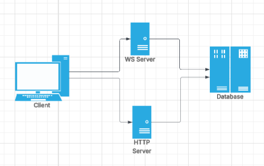
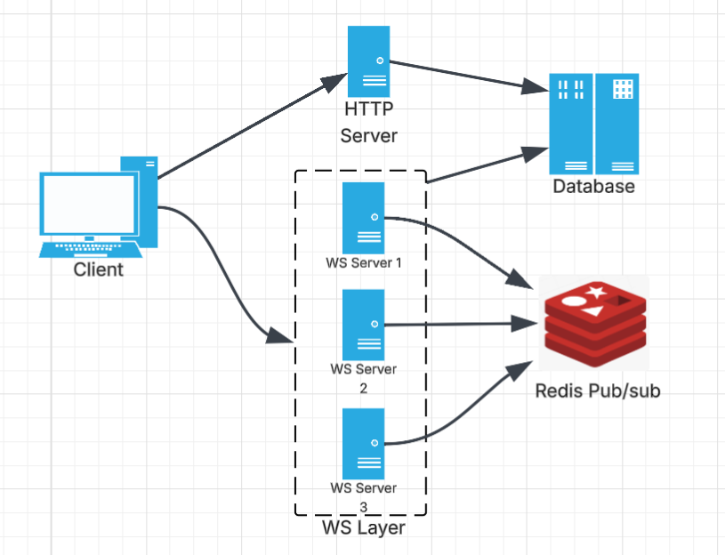

# Sketchly

Sketchly is a simple collaborative drawing tool that allows users to create and share sketches in real time. It provides basic drawing functionalities and supports multiple users working together in a shared space.

## Features

- **Authentication**: Secure user authentication using JSON Web Tokens (JWT).
- **Room Creation and Sharing**: Create and share rooms using unique sharable links for collaboration.
- **Real-time Collaboration**: Seamless real-time communication powered by WebSocket and Redis Pub/Sub.
- **Basic Drawing Functionalities**: Includes tools for drawing objects to create and edit sketches.
- **Optimized Performance**: Leveraging pnpm and TurboRepo for faster builds and dependency management.

## Technology

- **Frontend**: React.js for building the user interface.
- **Backend**: Node.js with Express.js for handling server-side logic.
- **Database**: PostgreSQL for robust and reliable data storage.
- **ORM**: PrismaORM for database interactions, schema migrations, and type-safe queries.
- **Authentication**: JSON Web Tokens (JWT) for secure and stateless user authentication.
- **TypeScript**: Ensures type safety and enhances developer productivity.
- **Real-time Communication**: Redis Pub/Sub over a WebSocket layer to enable real-time updates and interactions.
- **Monorepo Management**: TurboRepo for efficient management of multiple packages in the project.
- **Package Manager**: pnpm for faster and efficient dependency management.

## Architecture

### Basic Architecture

Sketchly comprises an HTTP server (Express.js) for RESTful APIs, a WebSocket server for real-time collaboration, and a PostgreSQL database for persistent storage. Both servers interact with the database via PrismaORM, ensuring efficient and type-safe operations.



### Implemented Architecture

The implemented architecture comprises of redis pub/sub to horizonatally scale wsbsockets server.



## Local Setup Guide

### Requirements

- Node version 20.0.0 or later
- pnpm version 9.0.0 or later
- git to clone the repo locally
- Install pnpm using npm
- Docker 28.0.0 or later

```
npm install -g pnpm
```

### Steps to setup

1. Clone the repo locally

```
git clone https://github.com/harsh-b14/sketchly`
```

2. Install dependencies

```
pnpm install
```

3. Set the PostgreSQL database either locally using docker or start from NeonDB. Then enter the `DATABASE_URL` in .env file. Run the following commands to migrate the databse and genrate the prisma client.

```
pnpm run db:migrate
pnpm run db:generate
```

4. Start the redis server locally using Docker.

```
docker run -d -p 6379:6379 redis:latest
```

5. Enter you `JWT_SECRET` in .env file.

6. Run the dev script from root folder.

```
pnpm run dev
```

Else first build the project and then start it.

```
pnpm run build
pnpm run start
```

## Contributing

Contributions are welcome!  
1. Fork the repository  
2. Create a new branch (`git checkout -b feature-name`)  
3. Commit your changes  
4. Push and open a pull request

Please check existing issues or open a new one for suggestions and bugs.

